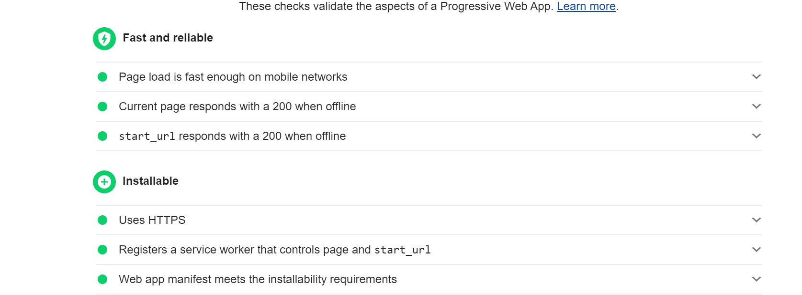

  # PWA Convert
  
   
    
  [Link to deployed app](https://powerful-stream-47259.herokuapp.com/)
  This is the configuring of a budget tracking application to meet the standards of a progressive web application. It is now installable, functional offline, and maintains offline presence.
  
  ## Table of Contents
  * [Installation](#installation)
  * [Usage](#usage)
  * [License](#license)
  * [Contributing](#Contributing)
  * [Questions](#Questions)

  
  
  ## Installation
  The application is installable as a pwa through the browser (note that this feature is not available through explorer)
  undefined
  ## Usage
  The application will track a budget through input transactions, these transactions will be indexed localy if internet accesses is not available, and will populate the application once connection is secured.
  undefined
  ## License
  MIT
  ## Contributing
  If one would like to contribute feel free to open a issue, or email the provided address below

  ## Questions
  [Email](mailto:emailcodydiab@gmail.com)

  [GitHub](https://github.com/CodyDiab)
